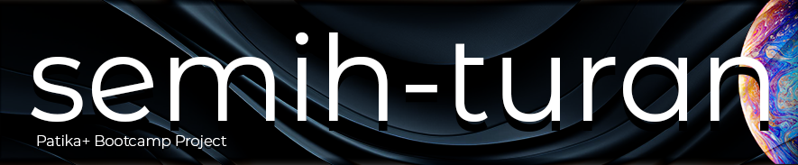
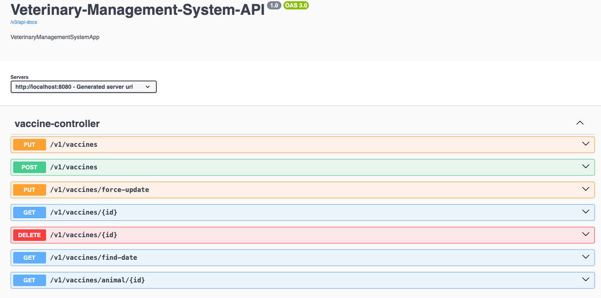

# Veterinary Management System API

## Project Description

The veterinary management system project provides an API for a veterinary clinic to manage its operations. This application is used by veterinary staff to manage veterinary doctors, customers, animals, and vaccines. It also handles the scheduling of appointments and the management of doctors' available dates.

### Technologies
    

## Project Overview
The veterinary management system offers a comprehensive management solution for veterinary clinics. This project is developed using Spring Boot and PostgreSQL and is designed with a layered architecture.

### Project Features
- Management of veterinary doctors, including creation, update, viewing, and deletion.
- Management of doctors' available dates, including creation, update, viewing, and deletion.
- Management of customers, including creation, update, viewing, and deletion.
- Management of animals, including creation, update, viewing, and deletion.
- Management of vaccines applied to animals, including creation, update, viewing, and deletion.
- Scheduling of appointments with date and time, checking for availability and avoiding conflicts.

### Architecture
**Layered Architecture:** The application is developed following a layered architecture pattern.
**Dependency Injection:** Constructor injection is used for Inversion of Control (IoC) and Dependency Injection (DI).
**Exception Handling:** Custom exceptions are used for error handling, ensuring meaningful responses to API users.
**Data Transfer Objects (DTOs):** Request and response DTOs are used for API endpoints.
**Database:** Postgresql is used as the relational database, with Spring Data JPA for data access.
**API Documentation:** API endpoints are documented for easy integration and usage in swagger.
**Sample Data:** Sample data is provided in the database for testing and demonstration purposes.

### API Endpoints

The API documentation is available at [/swagger-ui/index.html](http://localhost:8080/swagger-ui/index.html#/) with Swagger UI. The documentation provides details about the API endpoints, request and response bodies, and sample requests.



### Project Setup and Running
1. **Clone the Repository:**
   ```git clone https://github.com/username/veterinary-management-system.git```
   ```cd veterinary-management-system```


2. **Install Dependencies:**
    ```./mvnw clean install```


3. **Configure the Database:**
Set up your PostgreSQL database and update the ```application.properties``` file.


4. **Run the Application:**
    ```./mvnw spring-boot:run```

### Sample Data
The application provides sample data for testing and demonstration purposes. The sample data is loaded using the ```SQL/veterinary.sql``` file.

### UML Diagram


### Requirements
JDK 22 or higher
Spring Boot 3.2.5 or higher

### Contribution
If you wish to contribute to the project, please create a pull request or open an issue. All contributions are welcome.

### License
This project is licensed under the MIT License. See the LICENSE file for details.

### Contact
For questions or suggestions, please contact us at semituran@gmail.com.