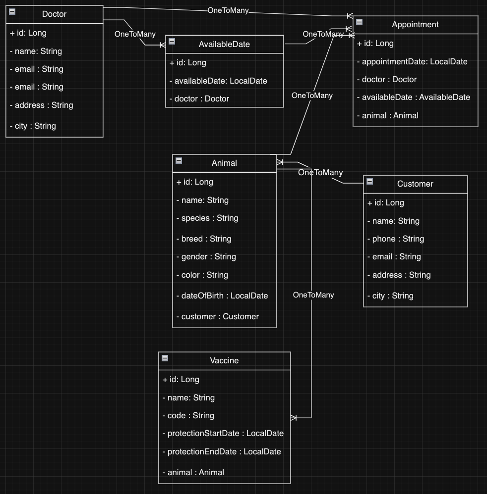

# Veterinary Management System

## Project Description
The veterinary management system project provides an API for a veterinary clinic to manage its operations. This application is used by veterinary staff to manage veterinary doctors, customers, animals, and vaccines. It also handles the scheduling of appointments and the management of doctors' available dates.

## Project Overview
The veterinary management system offers a comprehensive management solution for veterinary clinics. This project is developed using Spring Boot and PostgreSQL and is designed with a layered architecture.

### Project Features
- Management of veterinary doctors, including creation, update, viewing, and deletion.
- Management of doctors' available dates, including creation, update, viewing, and deletion.
- Management of customers, including creation, update, viewing, and deletion.
- Management of animals, including creation, update, viewing, and deletion.
- Management of vaccines applied to animals, including creation, update, viewing, and deletion.
- Scheduling of appointments with date and time, checking for availability and avoiding conflicts.


### API Endpoints
Add table

### Project Setup and Running
1. **Clone the Repository:**
   ```bash
   git clone https://github.com/username/veterinary-management-system.git
   cd veterinary-management-system

2. **Install Dependencies:**
    ```bash
    ./mvnw clean install

3. **Configure the Database:**
Set up your PostgreSQL database and update the ***application.properties*** file.

4. **Run the Application:**
    ```bash
    ./mvnw spring-boot:run

### Requirements
JDK 22 or higher
Spring Boot 3.2.5 or higher

### Contribution
If you wish to contribute to the project, please create a pull request or open an issue. All contributions are welcome.

### License
This project is licensed under the MIT License. See the LICENSE file for details.

### UML Diagram


### Contact
For questions or suggestions, please contact us at semituran@gmail.com.